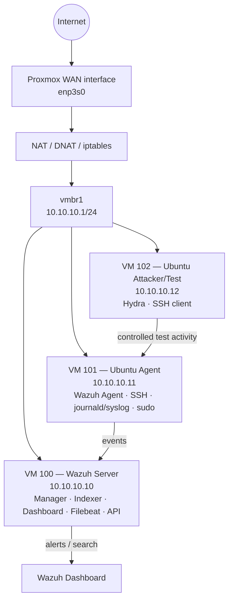

# Wazuh SIEM Lab on Proxmox VE


A documented security-monitoring laboratory implementing **Wazuh 4.14.6 on Proxmox VE 9.2.4**, hosted on Debian 13. The project demonstrates virtualization, private networking, NAT/DNAT, endpoint onboarding, Wazuh telemetry collection, custom detection engineering, controlled attack simulation, alert validation, and structured troubleshooting.

> **Scope & safety:** This repository documents an isolated, authorized laboratory. Testing was performed only against systems created for the project. Public addresses, credentials, and other sensitive values are intentionally omitted or redacted.

## Project at a glance

| Area | Implementation |
|---|---|
| Host | SSDNodes VPS, Debian 13 |
| Hypervisor | Proxmox VE 9.2.4 |
| Private network | `10.10.10.0/24` via `vmbr1` |
| Wazuh | 4.14.6 all-in-one |
| Wazuh server | VM 100 — `10.10.10.10` |
| Monitored endpoint | VM 101 — `10.10.10.11` |
| Test/attacker VM | VM 102 — `10.10.10.12` |
| Detection scenarios | SSH password spraying; repeated failed sudo |
| Custom rules | `100100` (Level 12), `100140` (Level 14) |
| MITRE ATT&CK | T1110.003; T1548.003 |
| Evidence | 25 report figures/screenshots |

## Architecture



The report describes a layered design consisting of the VPS host, Debian/Proxmox virtualization layer, private virtual network, and Wazuh monitoring layer. The guests do not have direct public addresses; outbound traffic is source-translated and only explicitly required administrative/dashboard services are DNATed.

## What was implemented

- Installed Proxmox VE on a Debian 13 VPS.
- Provisioned three lightweight Ubuntu Server VMs with fixed private addresses.
- Built a private `vmbr1` network and enabled IPv4 forwarding.
- Implemented outbound MASQUERADE and controlled DNAT/forwarding rules with iptables.
- Deployed the Wazuh 4.14.6 all-in-one stack: Manager, Indexer, Dashboard, Filebeat and API.
- Enrolled the monitored Ubuntu endpoint as Wazuh Agent `001`.
- Validated the Wazuh data path from endpoint logs through rule processing and dashboard alerts.
- Engineered custom detections for repeated SSH authentication failures and failed sudo elevation attempts.
- Conducted controlled test scenarios and captured both the test action and resulting alert.
- Documented troubleshooting involving resources, DNS, Proxmox services, NAT/DNAT, Wazuh service readiness, certificates, credentials, API configuration, and rule validation.

## Detection engineering

### SSH password spraying

- Custom rule: **100100**
- Severity: **Level 12**
- Parent/base event: Wazuh SSH authentication-failure rule **5760**
- Correlation: **3 matches within 120 seconds from the same source IP**
- MITRE ATT&CK: **T1110.003 — Password Spraying**

The report notes that a stronger production implementation should also verify attempts against different usernames where the available decoded fields support that correlation, and that thresholds should be tuned against normal authentication volume.

### Repeated failed sudo elevation

- Custom rule: **100140**
- Severity: **Level 14**
- Parent/base event: Wazuh sudo failure rule **5404**
- Correlation: **2 matches within 300 seconds for the same source user**
- MITRE ATT&CK: **T1548.003 — Sudo and Sudo Caching**

The validation scenario used `sudo su` with three intentionally incorrect password entries. The resulting alert recorded the affected agent, user context, attempted destination account, command, rule metadata, severity, and MITRE mapping.

> A Wazuh detection is not automatically proof of compromise. Analyst review and contextual correlation are still required.

## Network design

The implemented external mappings were:

| External port | Internal destination | Purpose |
|---:|---|---|
| `2222` | `10.10.10.10:22` | Wazuh server SSH |
| `8443` | `10.10.10.10:443` | Wazuh Dashboard HTTPS |
| `2223` | `10.10.10.11:22` | Agent SSH |
| `2224` | `10.10.10.12:22` | Attacker/test VM SSH |

Wazuh internal services remained private, including agent event forwarding (`1514/TCP`), agent enrollment (`1515/TCP`), API (`55000/TCP`) and indexer HTTPS (`9200/TCP`).

## Key implementation commands

### Proxmox host preparation

```bash
apt update
apt install -y curl gnupg2
hostnamectl
getent hosts $(hostname)
```

### Proxmox installation

```bash
echo "deb http://download.proxmox.com/debian/pve trixie pve-no-subscription" \
  > /etc/apt/sources.list.d/pve-install-repo.list

curl -fsSL https://enterprise.proxmox.com/debian/proxmox-release-trixie.gpg \
  -o /etc/apt/trusted.gpg.d/proxmox-release-trixie.gpg

apt update
apt install -y proxmox-ve postfix open-iscsi
reboot
```

### Wazuh all-in-one installation

```bash
curl -sO https://packages.wazuh.com/4.14/wazuh-install.sh
sudo bash wazuh-install.sh -a
```

### Rule validation

```bash
sudo /var/ossec/bin/wazuh-analysisd -t
sudo /var/ossec/bin/wazuh-logtest
sudo systemctl restart wazuh-manager
sudo journalctl -u wazuh-manager -n 100 --no-pager
```

See [`commands/`](commands/) for the documented command sets and [`configs/`](configs/) for configuration references.

## Evidence

The repository includes the figures embedded in the implementation report, renamed in document order. The most useful evidence includes:

- **Figure 2:** overall SSDNodes / Proxmox / private-network architecture.
- **Figure 3:** NAT, DNAT and port-forwarding topology.
- **Figure 7:** Wazuh VM resource utilization.
- **Figure 8:** `enp3s0` and `vmbr1` network configuration.
- **Figures 9–10:** IPv4 forwarding and active iptables rules.
- **Figure 13:** Wazuh overview dashboard and capability areas.
- **Figure 16:** custom rule definitions.
- **Figures 22–25:** controlled testing and resulting Level 12 / Level 14 alerts.

All evidence should remain redacted before public publication.

## Troubleshooting highlights

The implementation deliberately documents the engineering problems encountered rather than presenting the deployment as a simple installation:

- Nested virtualization caused lag/disconnections; the environment was moved to a dedicated VPS with lightweight guests.
- Proxmox node/service issues were traced to hostname and `/etc/hosts` resolution and service health.
- Guest DNS/connectivity problems were investigated layer-by-layer through bridge configuration, routing, forwarding, MASQUERADE and resolver settings.
- DNAT timeouts were separated into translation, forwarding, routing and destination-service checks.
- NAT rules were made persistent with `iptables-persistent` and persistent IPv4-forwarding configuration.
- Wazuh dashboard readiness was investigated through Manager, Indexer, Filebeat, Dashboard logs and resource utilization.
- Indexer `401` responses were treated as authentication/authorization issues rather than basic network failures.
- Rule changes were validated with `wazuh-analysisd -t` and `wazuh-logtest` before restarting the manager.

## Repository structure

```text
wazuh-proxmox-siem-lab/
├── README.md
├── SECURITY.md
├── configs/
│   ├── iptables-ruleset.md
│   └── detection-rules.md
├── commands/
│   ├── proxmox-host.md
│   ├── wazuh-deployment.md
│   └── validation.md
├── docs/
│   ├── architecture.md
│   ├── detection-engineering.md
│   ├── troubleshooting.md
│   └── implementation-report.docx
├── evidence/
│   ├── 01-vps-service-host-specification.png
│   ├── 02-ssdnodes-proxmox-private-network-vm-architecture.png
│   ├── 03-proxmox-vmbr1-nat-dnat-topology.png
│   ├── ...
│   └── 25-wazuh-level-14-sudo-privilege-escalation-alert.png
│   └── README.md
└── scripts/
    └── validate-wazuh-services.sh
```

## Results

The report records the main objectives as completed: Proxmox deployment, private three-VM topology, NAT/DNAT, Wazuh 4.14.6 deployment, endpoint onboarding, custom detection creation, and validation of both controlled scenarios. The project demonstrates the complete path from endpoint activity to correlated Wazuh alert and analyst-facing evidence.

## Limitations and future improvements

This is a **single-node training/lab implementation**, not a production SOC architecture. It does not include multi-node Proxmox clustering, distributed Wazuh components, enterprise-scale endpoint fleets, or 24/7 production incident response.

For production hardening, the report recommends continued detection tuning, false-positive testing, least-privilege access, controlled automation, appropriate data-volume/retention settings, and verification of the complete data path rather than relying only on dashboard or service status.

## Documentation

- [Architecture](docs/architecture.md)
- [Detection engineering](docs/detection-engineering.md)
- [Troubleshooting](docs/troubleshooting.md)
- [Proxmox commands](commands/proxmox-host.md)
- [Wazuh deployment](commands/wazuh-deployment.md)
- [Validation commands](commands/validation.md)
- [iptables ruleset](configs/iptables-ruleset.md)
- [Detection specifications](configs/detection-rules.md)
- [Full implementation report](docs/implementation-report.docx)

---

**Project type:** Authorized security lab / portfolio project  
**Primary focus:** SIEM deployment, Linux security monitoring, detection engineering, virtualization and network security
